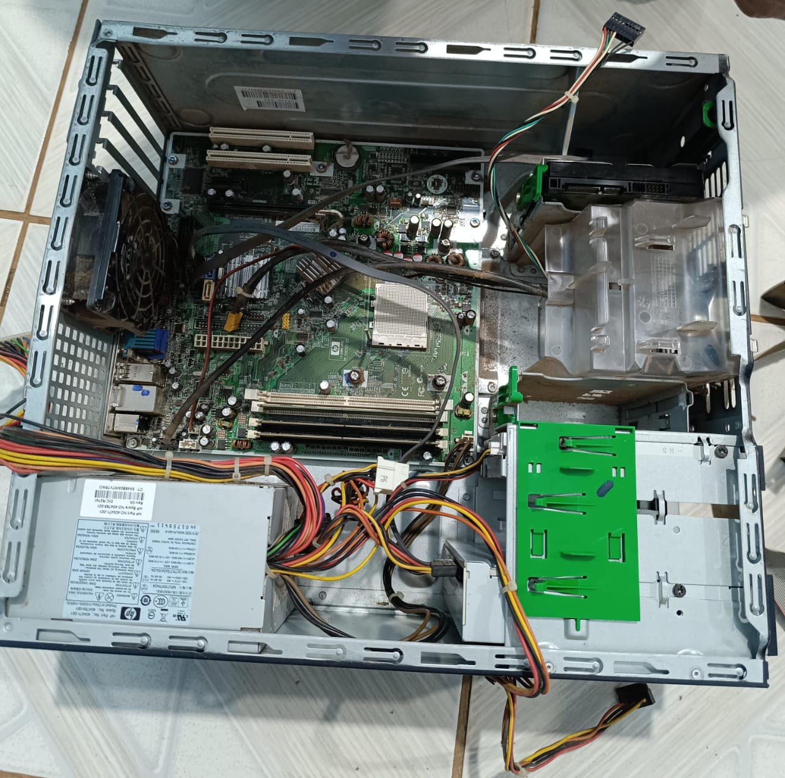

# relatório
## aula 4
**computadores do gm3**
# Relatórios Manutenção e Montagem de computadores 
## Aula 04 
Cada estudante ficou responsável por um gabinete, disponibilizado pela Escola GM3. Na oportunidade, além de abrir o gabinete, vimos internamente, tendo a oportunidade de testar a Fonte, memórias e placa-mãe. 

Periférico         | Possui  | Especificações
-------------------| ------- | -------------
Placa-mãe          | sim     | Asus
Memória RAM        | Sim     | 1GB DDR 2 200 MHz
Disco Rígido       | Sim     | 80GB
Fonte              | sim     | 110V
Gabinete           | sim     | Sem a tampa lateral

trabalho feito em dupla por: patricia kimberly e bianca almeida